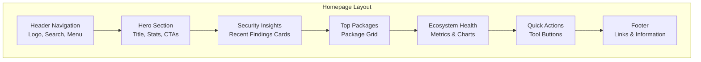

# Design Document

## Overview

This design document outlines the transformation of the NodeWatch homepage from a basic interface into an engaging, informative dashboard that showcases the npm malware detection system's capabilities. The new homepage will serve as the primary entry point, featuring a hero section with key metrics, security insights, top package previews, and intuitive navigation to deeper functionality.

The design emphasizes immediate value delivery, showing users critical security information at first glance while providing clear pathways to explore detailed analysis results and use the system's advanced features.

## Architecture

### Frontend Architecture

```mermaid
graph TB
    subgraph "Homepage Components"
        HERO[Hero Section<br/>Stats & CTA]
        SEARCH[Search Hub<br/>Autocomplete]
        INSIGHTS[Security Insights<br/>Recent Findings]
        PACKAGES[Top Packages<br/>Grid Display]
        HEALTH[Ecosystem Health<br/>Metrics Dashboard]
        ACTIONS[Quick Actions<br/>Tool Shortcuts]
        FOOTER[Footer<br/>Links & Info]
    end
    
    subgraph "Data Layer"
        API[Express API<br/>Real-time Data]
        CONVEX[(Convex Database<br/>Package Data)]
        CACHE[Redis Cache<br/>Performance]]
    end
    
    subgraph "External Navigation"
        DETAIL[Package Detail Pages<br/>Dynamic Generation]
        BROWSE[Browse All Packages<br/>Full List View]
        DEPS[Dependency Explorer<br/>Interactive Trees]
        ANALYTICS[Security Analytics<br/>Trend Reports]
    end
    
    %% Component to Data Flow
    HERO --> API
    SEARCH --> API
    INSIGHTS --> API
    PACKAGES --> API
    HEALTH --> API
    ACTIONS --> API
    
    %% API to Database
    API --> CONVEX
    API --> CACHE
    
    %% Navigation Flow
    SEARCH --> DETAIL
    PACKAGES --> DETAIL
    ACTIONS --> BROWSE
    ACTIONS --> DEPS
    HEALTH --> ANALYTICS
    
    %% Real-time Updates
    CONVEX -.-> HERO
    CONVEX -.-> INSIGHTS
    CONVEX -.-> PACKAGES
    CONVEX -.-> HEALTH
```

### Page Layout Structure



## Components and Interfaces

### 1. Hero Section Component

```typescript
interface HeroSectionProps {
  stats: SystemStats;
  isLoading: boolean;
  onSearchClick: () => void;
  onBrowseClick: () => void;
}

interface SystemStats {
  totalPackagesAnalyzed: number;
  malwareDetected: number;
  lastScanTime: Date;
  currentlyAnalyzing: number;
  queueDepth: number;
  analysisRate: number; // packages per hour
}

interface HeroSectionComponent {
  // Visual Elements
  title: string;
  subtitle: string;
  backgroundGradient: string;
  
  // Statistics Display
  renderStats(stats: SystemStats): JSX.Element;
  renderLiveCounter(currentlyAnalyzing: number): JSX.Element;
  
  // Call-to-Action Buttons
  primaryCTA: {
    text: "Search Packages";
    action: () => void;
    variant: "primary";
  };
  secondaryCTA: {
    text: "View Top 1000";
    action: () => void;
    variant: "secondary";
  };
}
```

### 2. Security Insights Component

```typescript
interface SecurityInsightsProps {
  recentFindings: SecurityFinding[];
  isLoading: boolean;
  onFindingClick: (packageName: string) => void;
}

interface SecurityFinding {
  id: string;
  packageName: string;
  version: string;
  threatType: ThreatType;
  severity: SeverityLevel;
  discoveryDate: Date;
  summary: string;
  impactDescription: string;
  affectedDownloads: number;
}

enum ThreatType {
  MALWARE = 'malware',
  CREDENTIAL_THEFT = 'credential_theft',
  CODE_INJECTION = 'code_injection',
  TYPOSQUATTING = 'typosquatting',
  SUPPLY_CHAIN = 'supply_chain',
  BACKDOOR = 'backdoor'
}

enum SeverityLevel {
  CRITICAL = 'critical',
  HIGH = 'high',
  MEDIUM = 'medium',
  LOW = 'low'
}

interface SecurityInsightsComponent {
  renderFindingCard(finding: SecurityFinding): JSX.Element;
  renderEmptyState(): JSX.Element; // When no recent threats
  renderLoadingState(): JSX.Element;
  getSeverityColor(severity: SeverityLevel): string;
  getThreatIcon(type: ThreatType): string;
}
```

### 3. Top Packages Component

```typescript
interface TopPackagesProps {
  packages: PackagePreview[];
  isLoading: boolean;
  onPackageClick: (packageName: string) => void;
  onViewAllClick: () => void;
}

interface PackagePreview {
  name: string;
  version: string;
  weeklyDownloads: number;
  riskScore: number;
  riskLevel: RiskLevel;
  analysisStatus: AnalysisStatus;
  lastAnalyzed?: Date;
  shortDescription: string;
  maintainer: string;
}

enum RiskLevel {
  SAFE = 'safe',
  LOW = 'low',
  MEDIUM = 'medium',
  HIGH = 'high',
  CRITICAL = 'critical'
}

enum AnalysisStatus {
  COMPLETED = 'completed',
  IN_PROGRESS = 'in_progress',
  QUEUED = 'queued',
  FAILED = 'failed',
  PENDING = 'pending'
}

interface TopPackagesComponent {
  renderPackageCard(pkg: PackagePreview): JSX.Element;
  renderProgressIndicator(status: AnalysisStatus, progress?: number): JSX.Element;
  getRiskLevelColor(level: RiskLevel): string;
  formatDownloadCount(count: number): string;
  renderGridLayout(packages: PackagePreview[]): JSX.Element;
}
```

### 4. Search Hub Component

```typescript
interface SearchHubProps {
  onSearch: (query: string) => void;
  onAdvancedSearch: () => void;
  recentSearches?: string[];
  popularPackages?: string[];
}

interface SearchSuggestion {
  packageName: string;
  downloadCount: number;
  riskLevel: RiskLevel;
  matchType: 'exact' | 'partial' | 'similar';
}

interface SearchHubComponent {
  // Search Input
  searchInput: {
    placeholder: "Search npm packages...";
    autoComplete: boolean;
    debounceMs: 300;
  };
  
  // Autocomplete
  renderSuggestions(suggestions: SearchSuggestion[]): JSX.Element;
  handleSuggestionClick(suggestion: SearchSuggestion): void;
  
  // Quick Access
  renderRecentSearches(searches: string[]): JSX.Element;
  renderPopularPackages(packages: string[]): JSX.Element;
  
  // Advanced Search
  advancedSearchButton: {
    text: "Advanced Search";
    onClick: () => void;
  };
}
```

### 5. Ecosystem Health Component

```typescript
interface EcosystemHealthProps {
  healthMetrics: HealthMetrics;
  trendData: TrendData[];
  isLoading: boolean;
  onViewAnalytics: () => void;
}

interface HealthMetrics {
  safePackagePercentage: number;
  threatDetectionRate: number;
  analysisCoverage: number;
  averageRiskScore: number;
  weeklyChange: {
    safePackages: number;
    threatsDetected: number;
    newPackagesAnalyzed: number;
  };
}

interface TrendData {
  date: Date;
  malwareDetected: number;
  packagesAnalyzed: number;
  averageRiskScore: number;
}

interface EcosystemHealthComponent {
  renderHealthScore(percentage: number, label: string): JSX.Element;
  renderTrendChart(data: TrendData[]): JSX.Element;
  renderChangeIndicator(change: number, isPositive: boolean): JSX.Element;
  renderWarningAlerts(metrics: HealthMetrics): JSX.Element;
}
```

### 6. Quick Actions Component

```typescript
interface QuickActionsProps {
  onAnalyzePackage: () => void;
  onComparePackages: () => void;
  onViewDependencies: () => void;
  userPreferences?: UserPreferences;
}

interface QuickAction {
  id: string;
  title: string;
  description: string;
  icon: string;
  action: () => void;
  disabled?: boolean;
  badge?: string; // e.g., "New", "Beta"
}

interface UserPreferences {
  recentlyViewed: string[];
  favoritePackages: string[];
  preferredActions: string[];
}

interface QuickActionsComponent {
  actions: QuickAction[];
  renderActionButton(action: QuickAction): JSX.Element;
  renderPersonalizedActions(preferences: UserPreferences): JSX.Element;
  renderQueueStatus(): JSX.Element; // Show current queue status
}
```

## Data Models

### Homepage Data Structure

```typescript
interface HomepageData {
  // Hero Section Data
  systemStats: SystemStats;
  
  // Security Insights Data
  recentFindings: SecurityFinding[];
  
  // Top Packages Data
  topPackages: PackagePreview[];
  
  // Health Metrics Data
  healthMetrics: HealthMetrics;
  trendData: TrendData[];
  
  // Search Data
  popularSearches: string[];
  trendingPackages: string[];
  
  // User-specific Data (if authenticated)
  userPreferences?: UserPreferences;
  recentActivity?: UserActivity[];
}

interface UserActivity {
  type: 'search' | 'view' | 'analyze';
  packageName?: string;
  timestamp: Date;
  details?: any;
}
```

### API Endpoints for Homepage

```typescript
interface HomepageAPI {
  // Main homepage data
  getHomepageData(): Promise<HomepageData>;
  
  // Real-time updates
  getSystemStats(): Promise<SystemStats>;
  getRecentFindings(limit?: number): Promise<SecurityFinding[]>;
  
  // Search functionality
  searchPackages(query: string, limit?: number): Promise<SearchSuggestion[]>;
  getPopularPackages(limit?: number): Promise<PackagePreview[]>;
  
  // Health metrics
  getHealthMetrics(): Promise<HealthMetrics>;
  getTrendData(days?: number): Promise<TrendData[]>;
  
  // User-specific data
  getUserPreferences(userId: string): Promise<UserPreferences>;
  updateUserPreferences(userId: string, prefs: UserPreferences): Promise<void>;
}
```

## User Interface Design

### Visual Design System

```typescript
interface DesignSystem {
  // Color Palette
  colors: {
    primary: '#2563eb'; // Blue
    secondary: '#7c3aed'; // Purple
    success: '#059669'; // Green
    warning: '#d97706'; // Orange
    danger: '#dc2626'; // Red
    neutral: {
      50: '#f9fafb';
      100: '#f3f4f6';
      500: '#6b7280';
      900: '#111827';
    };
  };
  
  // Risk Level Colors
  riskColors: {
    safe: '#059669';
    low: '#65a30d';
    medium: '#d97706';
    high: '#ea580c';
    critical: '#dc2626';
  };
  
  // Typography
  typography: {
    hero: {
      fontSize: '3.75rem';
      fontWeight: 'bold';
      lineHeight: '1.1';
    };
    heading: {
      fontSize: '1.875rem';
      fontWeight: 'semibold';
      lineHeight: '1.25';
    };
    body: {
      fontSize: '1rem';
      lineHeight: '1.5';
    };
    caption: {
      fontSize: '0.875rem';
      color: 'neutral.500';
    };
  };
  
  // Spacing
  spacing: {
    section: '4rem'; // Between major sections
    component: '2rem'; // Between components
    element: '1rem'; // Between elements
  };
  
  // Shadows and Effects
  effects: {
    cardShadow: '0 4px 6px -1px rgba(0, 0, 0, 0.1)';
    hoverShadow: '0 10px 15px -3px rgba(0, 0, 0, 0.1)';
    focusRing: '0 0 0 3px rgba(37, 99, 235, 0.1)';
  };
}
```

### Layout Specifications

```typescript
interface LayoutSpecs {
  // Container Widths
  maxWidth: '1280px';
  padding: {
    mobile: '1rem';
    tablet: '2rem';
    desktop: '3rem';
  };
  
  // Grid System
  grid: {
    columns: 12;
    gap: '1.5rem';
    breakpoints: {
      sm: '640px';
      md: '768px';
      lg: '1024px';
      xl: '1280px';
    };
  };
  
  // Section Heights
  hero: {
    minHeight: '60vh';
    maxHeight: '80vh';
  };
  
  // Component Sizes
  packageCard: {
    width: '320px';
    height: '200px';
    minWidth: '280px';
  };
  
  searchBar: {
    height: '48px';
    maxWidth: '600px';
  };
}
```

### Responsive Behavior

```typescript
interface ResponsiveDesign {
  // Mobile (< 768px)
  mobile: {
    hero: {
      layout: 'single-column';
      statsDisplay: 'stacked';
      ctaButtons: 'full-width';
    };
    packages: {
      grid: '1-column';
      cardSize: 'full-width';
    };
    search: {
      position: 'prominent';
      suggestions: 'overlay';
    };
  };
  
  // Tablet (768px - 1024px)
  tablet: {
    hero: {
      layout: 'two-column';
      statsDisplay: 'grid-2x2';
      ctaButtons: 'inline';
    };
    packages: {
      grid: '2-column';
      cardSize: 'medium';
    };
    search: {
      position: 'header';
      suggestions: 'dropdown';
    };
  };
  
  // Desktop (> 1024px)
  desktop: {
    hero: {
      layout: 'three-column';
      statsDisplay: 'horizontal';
      ctaButtons: 'inline';
    };
    packages: {
      grid: '3-column';
      cardSize: 'standard';
    };
    search: {
      position: 'header';
      suggestions: 'dropdown';
    };
  };
}
```

## Data Flow and State Management

### Component State Management

```typescript
interface HomepageState {
  // Loading States
  loading: {
    initial: boolean;
    stats: boolean;
    packages: boolean;
    insights: boolean;
    health: boolean;
  };
  
  // Data States
  data: HomepageData;
  
  // UI States
  ui: {
    searchQuery: string;
    searchSuggestions: SearchSuggestion[];
    selectedPackages: string[]; // For comparison
    showAdvancedSearch: boolean;
    activeSection: string;
  };
  
  // Error States
  errors: {
    [key: string]: string | null;
  };
}

interface HomepageActions {
  // Data Actions
  loadHomepageData(): Promise<void>;
  refreshStats(): Promise<void>;
  loadMorePackages(): Promise<void>;
  
  // Search Actions
  updateSearchQuery(query: string): void;
  performSearch(query: string): Promise<void>;
  selectSuggestion(suggestion: SearchSuggestion): void;
  
  // Navigation Actions
  navigateToPackage(packageName: string): void;
  navigateToAnalytics(): void;
  navigateToBrowse(): void;
  
  // User Actions
  addToComparison(packageName: string): void;
  removeFromComparison(packageName: string): void;
  updatePreferences(prefs: Partial<UserPreferences>): void;
}
```

### Real-time Updates

```typescript
interface RealTimeUpdates {
  // WebSocket Connection
  connection: WebSocket;
  
  // Event Handlers
  onStatsUpdate(stats: SystemStats): void;
  onNewFinding(finding: SecurityFinding): void;
  onAnalysisComplete(packageName: string, result: AnalysisResult): void;
  onQueueUpdate(queueStats: QueueStats): void;
  
  // Subscription Management
  subscribe(events: string[]): void;
  unsubscribe(events: string[]): void;
  
  // Connection Management
  connect(): Promise<void>;
  disconnect(): void;
  reconnect(): Promise<void>;
}
```

## Performance Optimization

### Caching Strategy

```typescript
interface CachingStrategy {
  // Browser Cache
  browserCache: {
    staticAssets: '1 year';
    apiResponses: '5 minutes';
    searchResults: '1 minute';
  };
  
  // Service Worker Cache
  serviceWorker: {
    homepageData: 'cache-first';
    packagePreviews: 'stale-while-revalidate';
    searchSuggestions: 'network-first';
  };
  
  // Memory Cache
  memoryCache: {
    searchSuggestions: {
      maxSize: 1000;
      ttl: 300000; // 5 minutes
    };
    packagePreviews: {
      maxSize: 500;
      ttl: 600000; // 10 minutes
    };
  };
}
```

### Loading Optimization

```typescript
interface LoadingOptimization {
  // Critical Path
  criticalResources: [
    'hero-section-data',
    'top-packages-preview',
    'search-functionality'
  ];
  
  // Lazy Loading
  lazyLoaded: [
    'security-insights',
    'ecosystem-health',
    'trend-charts',
    'footer-content'
  ];
  
  // Progressive Enhancement
  progressiveFeatures: {
    realTimeUpdates: 'after-initial-load';
    advancedSearch: 'on-demand';
    chartAnimations: 'after-data-load';
  };
  
  // Resource Hints
  preload: ['critical-css', 'hero-background'];
  prefetch: ['package-detail-route', 'search-api'];
  preconnect: ['api-domain', 'cdn-domain'];
}
```

## Error Handling

### Error Boundaries and Fallbacks

```typescript
interface ErrorHandling {
  // Component Error Boundaries
  boundaries: {
    HeroSection: {
      fallback: 'BasicStatsDisplay';
      retry: true;
    };
    SecurityInsights: {
      fallback: 'EmptyInsightsMessage';
      retry: false;
    };
    TopPackages: {
      fallback: 'LoadingPackageCards';
      retry: true;
    };
  };
  
  // Network Error Handling
  networkErrors: {
    timeout: {
      duration: 10000; // 10 seconds
      fallback: 'cached-data';
      retry: 'exponential-backoff';
    };
    serverError: {
      fallback: 'error-message';
      retry: 'manual';
    };
    offline: {
      fallback: 'offline-mode';
      retry: 'on-reconnect';
    };
  };
  
  // User-Friendly Messages
  errorMessages: {
    loadingFailed: "We're having trouble loading the latest data. Please try refreshing the page.";
    searchFailed: "Search is temporarily unavailable. Please try again in a moment.";
    analysisUnavailable: "Package analysis is currently unavailable. Please check back later.";
  };
}
```

## Testing Strategy

### Component Testing

```typescript
// Hero Section Tests
describe('HeroSection', () => {
  test('displays system statistics correctly');
  test('shows loading state while fetching data');
  test('handles missing statistics gracefully');
  test('calls correct actions on CTA button clicks');
  test('updates real-time counters');
});

// Search Hub Tests
describe('SearchHub', () => {
  test('provides autocomplete suggestions');
  test('handles search query submission');
  test('displays recent searches for returning users');
  test('navigates to advanced search correctly');
});

// Top Packages Tests
describe('TopPackages', () => {
  test('renders package cards with correct information');
  test('shows appropriate risk level colors');
  test('handles loading and error states');
  test('navigates to package details on click');
});
```

### Integration Testing

```typescript
// Homepage Integration Tests
describe('Homepage Integration', () => {
  test('loads all sections with real API data');
  test('handles real-time updates correctly');
  test('maintains state consistency across components');
  test('performs well with large datasets');
});

// Search Integration Tests
describe('Search Integration', () => {
  test('integrates with backend search API');
  test('provides relevant autocomplete suggestions');
  test('handles search result navigation');
  test('caches search results appropriately');
});
```

### Performance Testing

```typescript
// Performance Benchmarks
describe('Homepage Performance', () => {
  test('loads initial content within 3 seconds');
  test('achieves Lighthouse score > 90');
  test('handles 1000+ package cards efficiently');
  test('maintains 60fps during animations');
  test('uses less than 50MB memory');
});
```

This design provides a comprehensive foundation for creating an engaging, informative homepage that effectively showcases the NodeWatch npm malware detection system while providing excellent user experience and performance.