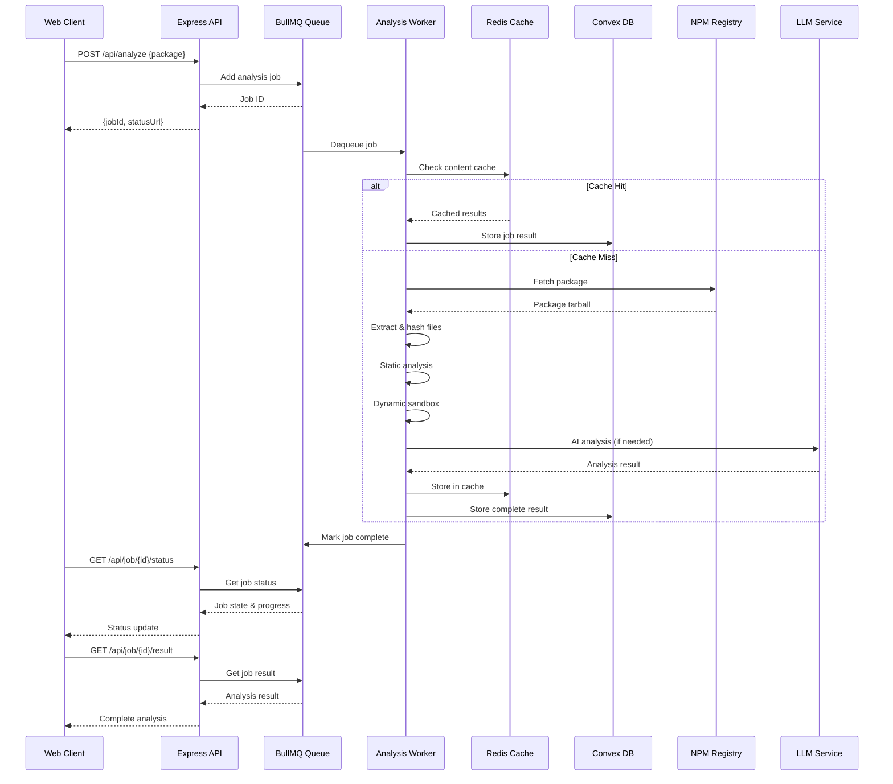
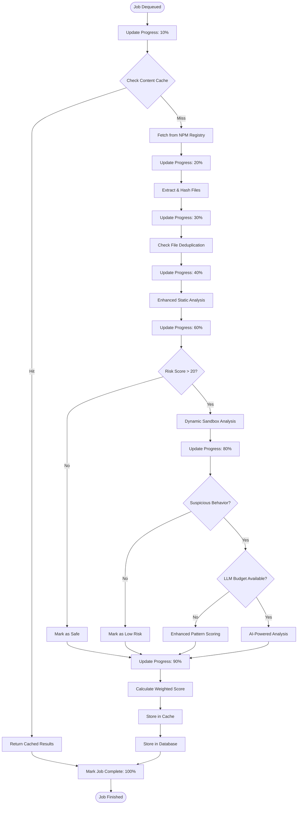

# Design Document

## Overview

This design document outlines the architecture for enhancing the existing NodeWatch MVP into a production-ready npm package malware detection system. The system will process the top 1,000 npm packages through a multi-stage analysis pipeline, featuring intelligent caching, real LLM integration, and dynamic sandbox analysis.

The enhanced system builds upon the existing Convex database foundation and Express API, adding sophisticated analysis capabilities while maintaining the simple web interface for immediate usability.

## Architecture

### High-Level System Architecture

```mermaid
graph TB
    subgraph "Client Layer"
        WEB[Web Interface]
        API_CLIENT[API Clients]
        CI_CD[CI/CD Integrations]
    end
    
    subgraph "API Gateway Layer"
        EXPRESS[Express API Server<br/>Job Management Only]
        RATE_LIMIT[Rate Limiter]
        AUTH[Authentication]
    end
    
    subgraph "Job Queue Layer"
        QUEUE[BullMQ Job Queue<br/>Redis Backend]
        SCHEDULER[Job Scheduler]
        MONITOR[Queue Monitor]
    end
    
    subgraph "Persistent Worker Layer"
        WORKER1[Analysis Worker 1<br/>Background Service]
        WORKER2[Analysis Worker 2<br/>Background Service]
        WORKER3[Analysis Worker N<br/>Background Service]
    end
    
    subgraph "Analysis Pipeline"
        STATIC[Enhanced Static Analyzer<br/>Pattern Detection]
        SANDBOX[Dynamic Sandbox<br/>Docker Containers]
        LLM[LLM Analyzer<br/>AI Code Review]
        SCORER[Risk Scorer<br/>Weighted Signals]
    end
    
    subgraph "Caching Layer"
        REDIS[(Redis Cache<br/>Multi-tier Caching)]
        DEDUP[Content Deduplication<br/>SHA-256 Based]
    end
    
    subgraph "Data Layer"
        CONVEX[(Convex Database<br/>Real-time Sync)]
        FILES[File Storage<br/>Package Content)]
    end
    
    subgraph "External Services"
        NPM[NPM Registry<br/>Package Source]
        OPENAI[OpenAI GPT-4<br/>Code Analysis]
        CLAUDE[Anthropic Claude<br/>Fallback LLM]
        LOCAL_LLM[Local LLM<br/>Cost Optimization]
    end
    
    %% Client to API Flow
    WEB --> EXPRESS
    API_CLIENT --> EXPRESS
    CI_CD --> EXPRESS
    
    %% API Gateway Processing
    EXPRESS --> RATE_LIMIT
    RATE_LIMIT --> AUTH
    AUTH --> QUEUE
    
    %% Job Queue to Workers
    QUEUE --> WORKER1
    QUEUE --> WORKER2
    QUEUE --> WORKER3
    
    %% Worker to Analysis Pipeline
    WORKER1 --> STATIC
    WORKER1 --> SANDBOX
    WORKER1 --> LLM
    
    WORKER2 --> STATIC
    WORKER2 --> SANDBOX
    WORKER2 --> LLM
    
    WORKER3 --> STATIC
    WORKER3 --> SANDBOX
    WORKER3 --> LLM
    
    %% Analysis Pipeline Flow
    STATIC --> SCORER
    SANDBOX --> SCORER
    LLM --> SCORER
    
    %% Data Storage
    SCORER --> CONVEX
    WORKER1 --> CONVEX
    WORKER2 --> CONVEX
    WORKER3 --> CONVEX
    
    %% Caching Integration
    WORKER1 --> REDIS
    WORKER2 --> REDIS
    WORKER3 --> REDIS
    
    STATIC --> DEDUP
    SANDBOX --> DEDUP
    LLM --> DEDUP
    
    %% File Storage
    WORKER1 --> FILES
    WORKER2 --> FILES
    WORKER3 --> FILES
    
    %% External Service Integration
    STATIC --> NPM
    LLM --> OPENAI
    LLM --> CLAUDE
    LLM --> LOCAL_LLM
    
    %% Status Polling (Non-blocking)
    WEB -.-> EXPRESS
    API_CLIENT -.-> EXPRESS
```

### Persistent Backend Service Architecture



### Enhanced Analysis Pipeline (Worker Process)



## Components and Interfaces

### 1. API Gateway Layer (Express Server)

```typescript
interface APIGateway {
  // Job Management (Non-blocking)
  queueAnalysis(name: string, version: string, options?: JobOptions): Promise<JobSubmissionResult>;
  getJobStatus(jobId: string): Promise<JobStatus>;
  getJobResult(jobId: string): Promise<AnalysisResult>;
  cancelJob(jobId: string): Promise<boolean>;
  
  // Queue Management
  getQueueStats(): Promise<QueueStats>;
  listJobs(status?: JobState, limit?: number): Promise<JobInfo[]>;
  
  // Batch Operations
  submitBatch(packages: PackageSpec[], options?: BatchOptions): Promise<BatchSubmissionResult>;
  getBatchStatus(batchId: string): Promise<BatchStatus>;
}

interface JobSubmissionResult {
  jobId: string;
  status: 'queued';
  estimatedTime?: number;
  position?: number;
  statusUrl: string;
  resultUrl: string;
}
```

### 2. Persistent Worker Service

```typescript
interface AnalysisWorkerService {
  // Worker Lifecycle
  start(): Promise<void>;
  stop(): Promise<void>;
  getWorkerStats(): Promise<WorkerStats>;
  
  // Job Processing (Background)
  processAnalysisJob(job: AnalysisJob): Promise<AnalysisResult>;
  updateJobProgress(jobId: string, progress: number, message?: string): Promise<void>;
  
  // Health Monitoring
  isHealthy(): boolean;
  getResourceUsage(): ResourceMetrics;
}

interface AnalysisJob {
  id: string;
  data: {
    packageName: string;
    version: string;
    priority: number;
    requestedBy?: string;
    options?: AnalysisOptions;
  };
  progress: number;
  state: JobState;
  createdAt: number;
  startedAt?: number;
}
```

### 3. Enhanced Analysis Pipeline Manager (Worker Internal)

```typescript
interface AnalysisPipelineManager {
  // Core Analysis (Background Processing)
  analyzePackage(name: string, version: string, jobId?: string): Promise<AnalysisResult>;
  
  // Progress Reporting
  reportProgress(jobId: string, stage: string, progress: number): Promise<void>;
  
  // Cache Integration
  checkCache(packageHash: string): Promise<AnalysisResult | null>;
  storeInCache(packageHash: string, result: AnalysisResult): Promise<void>;
}

interface PackageSpec {
  name: string;
  version: string;
  priority: number;
}

interface AnalysisResult {
  packageId: string;
  overallScore: number;
  riskLevel: RiskLevel;
  stages: {
    static: StaticAnalysisResult;
    dynamic?: DynamicAnalysisResult;
    llm?: LLMAnalysisResult;
  };
  metadata: PackageMetadata;
  processingTime: number;
  cacheHit: boolean;
}
```

### 2. Enhanced Static Analyzer

```typescript
interface EnhancedStaticAnalyzer {
  analyze(files: Map<string, FileContent>): Promise<StaticAnalysisResult>;
  detectObfuscation(content: string): ObfuscationResult;
  checkTyposquatting(packageName: string): TyposquattingResult;
  validateTarballIntegrity(tarball: Buffer, repoUrl?: string): IntegrityResult;
}

interface StaticAnalysisResult {
  suspiciousPatterns: SuspiciousPattern[];
  riskIndicators: RiskIndicators;
  obfuscationScore: number;
  typosquattingScore: number;
  integrityFlags: string[];
  score: number;
  confidence: number;
}

interface SuspiciousPattern {
  type: PatternType;
  file: string;
  line: number;
  snippet: string;
  severity: Severity;
  description: string;
  confidence: number;
}
```

### 3. Dynamic Sandbox Analyzer

```typescript
interface DynamicSandboxAnalyzer {
  analyze(packagePath: string, timeout: number): Promise<DynamicAnalysisResult>;
  createSandbox(config: SandboxConfig): Promise<SandboxInstance>;
  monitorBehavior(instance: SandboxInstance): Promise<BehaviorLog>;
}

interface DynamicAnalysisResult {
  behaviors: DetectedBehavior[];
  networkActivity: NetworkEvent[];
  fileOperations: FileOperation[];
  processSpawns: ProcessEvent[];
  resourceUsage: ResourceMetrics;
  score: number;
  suspiciousActivities: string[];
}

interface SandboxConfig {
  timeoutMs: number;
  memoryLimitMB: number;
  networkPolicy: 'blocked' | 'monitored' | 'allowed';
  filesystemPolicy: 'readonly' | 'isolated' | 'monitored';
  environmentVariables: Record<string, string>;
}
```

### 4. Real LLM Analyzer

```typescript
interface RealLLMAnalyzer {
  analyze(evidence: EvidenceBundle): Promise<LLMAnalysisResult>;
  createEvidenceBundle(
    files: Map<string, string>,
    staticResults: StaticAnalysisResult,
    dynamicResults?: DynamicAnalysisResult
  ): EvidenceBundle;
  selectProvider(costBudget: number, urgency: Priority): LLMProvider;
}

interface EvidenceBundle {
  suspiciousSnippets: CodeSnippet[];
  deobfuscatedStrings: string[];
  behaviorSummary: BehaviorSummary;
  metadataAnomalies: MetadataAnomaly[];
  contextualInfo: ContextInfo;
}

interface LLMAnalysisResult {
  verdict: 'benign' | 'suspicious' | 'malicious';
  confidence: number;
  reasoning: string[];
  specificThreats: ThreatIndicator[];
  recommendedActions: string[];
  score: number;
  provider: string;
  tokensUsed: number;
  costUSD: number;
}
```

### 5. Content Deduplication System

```typescript
interface ContentDeduplicationSystem {
  calculateFileHash(content: string): string;
  calculatePackageHash(files: Map<string, string>): string;
  getCachedAnalysis(hash: string): Promise<CachedResult | null>;
  storeCachedAnalysis(hash: string, result: AnalysisResult): Promise<void>;
  getDeduplicationStats(): Promise<DeduplicationStats>;
}

interface CachedResult {
  hash: string;
  result: AnalysisResult;
  createdAt: number;
  accessCount: number;
  lastAccessed: number;
}
```

### 6. Job Queue System

```typescript
interface JobQueueSystem {
  addAnalysisJob(spec: PackageSpec, options: JobOptions): Promise<string>;
  addBatchJob(specs: PackageSpec[], options: BatchOptions): Promise<string>;
  getJobStatus(jobId: string): Promise<JobStatus>;
  cancelJob(jobId: string): Promise<void>;
  getQueueStats(): Promise<QueueStats>;
}

interface JobOptions {
  priority: number;
  retryAttempts: number;
  timeoutMs: number;
  notificationWebhook?: string;
}
```

## Data Models

### Enhanced Database Schema

```typescript
// Enhanced Convex schema additions
export const enhancedSchema = {
  // Existing tables enhanced
  packages: {
    // ... existing fields
    contentHash: v.string(),
    downloadCount: v.optional(v.number()),
    maintainerInfo: v.optional(v.object({
      username: v.string(),
      email: v.optional(v.string()),
      twoFactorAuth: v.boolean(),
      accountAge: v.number(),
    })),
    dependencyCount: v.optional(v.number()),
    typosquattingScore: v.optional(v.number()),
  },

  // New tables
  file_hashes: defineTable({
    contentHash: v.string(),
    analysisResults: v.any(),
    firstSeen: v.number(),
    packageCount: v.number(), // How many packages contain this file
  }).index("by_hash", ["contentHash"]),

  dependency_graph: defineTable({
    packageId: v.id("packages"),
    dependencyId: v.id("packages"),
    versionRange: v.string(),
    dependencyType: v.string(), // "production", "development", "peer"
    depth: v.number(),
  }).index("by_package", ["packageId"])
    .index("by_dependency", ["dependencyId"]),

  sandbox_results: defineTable({
    packageId: v.id("packages"),
    behaviors: v.array(v.object({
      type: v.string(),
      timestamp: v.number(),
      details: v.any(),
      riskLevel: v.string(),
    })),
    networkEvents: v.array(v.object({
      type: v.string(),
      destination: v.string(),
      port: v.optional(v.number()),
      protocol: v.string(),
      blocked: v.boolean(),
    })),
    fileOperations: v.array(v.object({
      operation: v.string(),
      path: v.string(),
      success: v.boolean(),
      timestamp: v.number(),
    })),
    resourceMetrics: v.object({
      maxMemoryMB: v.number(),
      cpuTimeMs: v.number(),
      diskWritesMB: v.number(),
      networkBytesSent: v.number(),
    }),
    executionTimeMs: v.number(),
    exitCode: v.optional(v.number()),
  }).index("by_package", ["packageId"]),

  llm_analyses: defineTable({
    packageId: v.id("packages"),
    provider: v.string(),
    model: v.string(),
    evidenceBundle: v.any(),
    response: v.any(),
    tokensUsed: v.number(),
    costUSD: v.number(),
    processingTimeMs: v.number(),
    confidence: v.number(),
  }).index("by_package", ["packageId"])
    .index("by_provider", ["provider"]),

  batch_jobs: defineTable({
    name: v.string(),
    status: v.string(), // "pending", "running", "completed", "failed"
    totalPackages: v.number(),
    completedPackages: v.number(),
    failedPackages: v.number(),
    startedAt: v.optional(v.number()),
    completedAt: v.optional(v.number()),
    configuration: v.any(),
    results: v.optional(v.any()),
  }),
};
```

### Risk Scoring Model

```typescript
interface RiskScoringModel {
  signals: {
    // Critical signals (weight: 8-10)
    confirmedMalware: { weight: 10, threshold: 0.9 };
    credentialTheft: { weight: 10, threshold: 0.8 };
    remoteCodeExecution: { weight: 9, threshold: 0.8 };
    
    // High signals (weight: 5-7)
    obfuscatedCode: { weight: 7, threshold: 0.7 };
    suspiciousNetworkActivity: { weight: 6, threshold: 0.6 };
    fileSystemManipulation: { weight: 6, threshold: 0.6 };
    
    // Medium signals (weight: 3-4)
    typosquatting: { weight: 4, threshold: 0.5 };
    newMaintainer: { weight: 3, threshold: 0.4 };
    unusualDependencies: { weight: 3, threshold: 0.5 };
    
    // Low signals (weight: 1-2)
    noTwoFactorAuth: { weight: 1, threshold: 0.3 };
    largeSizeIncrease: { weight: 2, threshold: 0.4 };
  };
  
  calculateScore(detectedSignals: DetectedSignal[]): RiskScore;
  explainScore(score: RiskScore): ScoreExplanation;
}
```

## Error Handling

### Error Classification and Recovery

```typescript
enum ErrorType {
  NETWORK_ERROR = 'network_error',
  PARSING_ERROR = 'parsing_error',
  TIMEOUT_ERROR = 'timeout_error',
  RATE_LIMIT_ERROR = 'rate_limit_error',
  SANDBOX_ERROR = 'sandbox_error',
  LLM_API_ERROR = 'llm_api_error',
  STORAGE_ERROR = 'storage_error',
  VALIDATION_ERROR = 'validation_error',
}

interface ErrorHandler {
  handleError(error: Error, context: ErrorContext): Promise<ErrorResolution>;
  shouldRetry(error: Error, attemptCount: number): boolean;
  getRetryDelay(attemptCount: number): number;
}

interface ErrorResolution {
  action: 'retry' | 'skip' | 'fallback' | 'fail';
  fallbackResult?: Partial<AnalysisResult>;
  retryDelay?: number;
  notification?: NotificationSpec;
}
```

### Graceful Degradation Strategy

1. **LLM API Failures**: Fall back to enhanced pattern-based scoring
2. **Sandbox Failures**: Continue with static analysis only, flag for manual review
3. **NPM Registry Issues**: Use cached metadata if available, queue for retry
4. **Database Errors**: Store results in local cache, sync when available
5. **Memory/Resource Limits**: Process smaller batches, implement backpressure

## Testing Strategy

### Unit Testing

```typescript
// Static Analyzer Tests
describe('EnhancedStaticAnalyzer', () => {
  test('detects obfuscated eval patterns');
  test('identifies typosquatting attempts');
  test('validates tarball integrity');
  test('handles malformed JavaScript gracefully');
});

// Sandbox Tests
describe('DynamicSandboxAnalyzer', () => {
  test('isolates package execution properly');
  test('captures network activity accurately');
  test('enforces resource limits');
  test('handles timeout scenarios');
});

// LLM Analyzer Tests
describe('RealLLMAnalyzer', () => {
  test('creates appropriate evidence bundles');
  test('handles API failures gracefully');
  test('parses LLM responses correctly');
  test('manages cost budgets effectively');
});
```

### Integration Testing

```typescript
// Pipeline Integration Tests
describe('AnalysisPipeline', () => {
  test('processes known malicious packages correctly');
  test('handles cache hits and misses appropriately');
  test('maintains data consistency across stages');
  test('respects rate limits and timeouts');
});

// Database Integration Tests
describe('DatabaseIntegration', () => {
  test('stores and retrieves analysis results');
  test('maintains referential integrity');
  test('handles concurrent access properly');
  test('performs efficient queries with indexes');
});
```

### End-to-End Testing

```typescript
// E2E Test Scenarios
describe('SystemE2E', () => {
  test('analyzes top 100 packages successfully');
  test('handles batch processing with failures');
  test('provides accurate API responses');
  test('maintains system performance under load');
});
```

### Performance Testing

- **Load Testing**: Process 1000 packages concurrently
- **Stress Testing**: Handle API rate limits and resource exhaustion
- **Endurance Testing**: Run continuous analysis for 24 hours
- **Scalability Testing**: Measure performance with increasing worker counts

## Security Considerations

### Sandbox Security

1. **Container Isolation**: Use Docker with restricted capabilities
2. **Network Policies**: Block outbound connections by default
3. **File System**: Read-only base with isolated scratch space
4. **Resource Limits**: CPU, memory, and disk quotas
5. **Execution Timeout**: Hard limits on analysis time

### Data Protection

1. **Credential Sanitization**: Remove API keys and secrets from logs
2. **PII Handling**: Redact personal information from analysis results
3. **Access Control**: Role-based permissions for API endpoints
4. **Audit Logging**: Track all analysis requests and results

### API Security

1. **Rate Limiting**: Per-user and global request limits
2. **Authentication**: API key or JWT-based auth
3. **Input Validation**: Sanitize all user inputs
4. **CORS Policy**: Restrict cross-origin requests appropriately

## Deployment Architecture

### Development Environment

```yaml
# docker-compose.dev.yml
services:
  app:
    build: .
    ports: ["3000:3000"]
    environment:
      - NODE_ENV=development
      - CONVEX_URL=${CONVEX_URL}
    volumes:
      - ./src:/app/src
      - ./cache:/app/cache
  
  redis:
    image: redis:7-alpine
    ports: ["6379:6379"]
  
  sandbox:
    image: docker:dind
    privileged: true
    volumes:
      - /var/run/docker.sock:/var/run/docker.sock
```

### Production Environment

```yaml
# docker-compose.prod.yml
services:
  app:
    image: nodewatch:latest
    replicas: 3
    environment:
      - NODE_ENV=production
      - REDIS_URL=${REDIS_URL}
      - CONVEX_URL=${CONVEX_URL}
    resources:
      limits:
        memory: 2G
        cpus: 1.0
  
  worker:
    image: nodewatch-worker:latest
    replicas: 5
    environment:
      - WORKER_TYPE=analysis
      - REDIS_URL=${REDIS_URL}
    resources:
      limits:
        memory: 4G
        cpus: 2.0
  
  redis:
    image: redis:7-alpine
    volumes:
      - redis_data:/data
    resources:
      limits:
        memory: 1G
```

## Monitoring and Observability

### Metrics Collection

```typescript
interface SystemMetrics {
  // Performance Metrics
  analysisLatency: HistogramMetric;
  cacheHitRate: GaugeMetric;
  queueDepth: GaugeMetric;
  workerUtilization: GaugeMetric;
  
  // Business Metrics
  packagesAnalyzed: CounterMetric;
  malwareDetected: CounterMetric;
  falsePositiveRate: GaugeMetric;
  
  // System Health
  errorRate: CounterMetric;
  apiResponseTime: HistogramMetric;
  databaseConnections: GaugeMetric;
  memoryUsage: GaugeMetric;
}
```

### Alerting Rules

1. **High Error Rate**: > 5% of requests failing
2. **Queue Backup**: > 1000 jobs pending for > 30 minutes
3. **Low Cache Hit Rate**: < 70% cache hits
4. **Resource Exhaustion**: > 90% memory or CPU usage
5. **API Latency**: > 10 second response times

This design provides a comprehensive foundation for transforming the existing MVP into a production-ready system capable of analyzing thousands of npm packages efficiently and accurately.